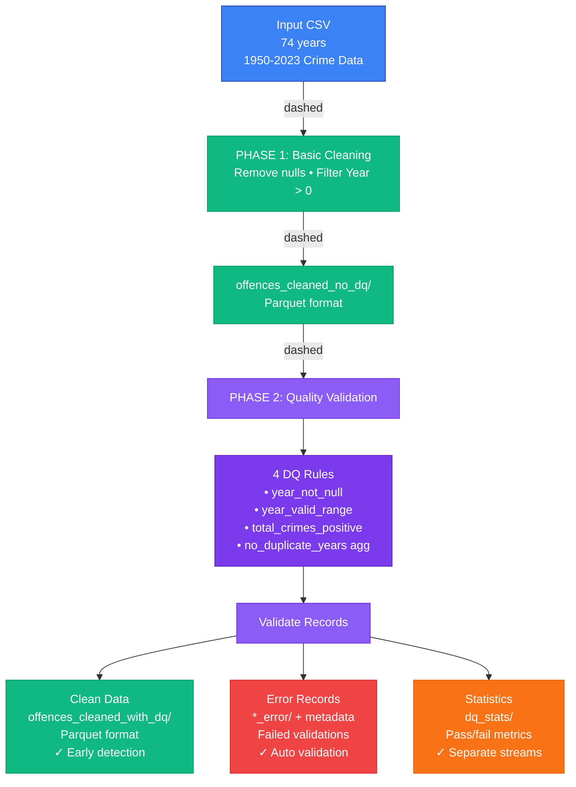

# SPARK-DQ-Checks

Data quality (DQ) pipeline on Apache Spark that demonstrates a shift-left approach to validating datasets using the Spark Expectations framework. The example uses UK crime statistics (1950-2023) to show a two-phase pipeline:

- Phase 1: Load + basic cleaning (no DQ framework)
- Phase 2: Apply declarative DQ rules and produce stats/outputs


## Architecture



The pipeline processes crime data through two phases:

**PHASE 1: Basic Cleaning**
- Input: CSV file (1950-2023 Crime Data, 74 years)
- Operations: Remove nulls • Filter Year > 0
- Output: `offences_cleaned_no_dq/` (Parquet format)

**PHASE 2: Quality Validation**
- 4 DQ Rules:
  - `year_not_null` (completeness)
  - `year_valid_range` (validity)
  - `total_crimes_positive` (validity)
  - `no_duplicate_years` (uniqueness - aggregate)
- Validate Records: Applies rules and routes data to three outputs
- Outputs:
  - **Clean Data**: `offences_cleaned_with_dq/` (Parquet format) — Early detection
  - **Error Records**: `*_error/` tables + metadata (Failed validations) — Auto validation
  - **Statistics**: `dq_stats/` (Pass/fail metrics) — Separate streams


### Features
- Run locally with `SparkSession` in local mode (no cluster required)
- Declarative DQ rules using `spark-expectations`
- Generates cleaned outputs and DQ statistics as parquet files
- Simple test to validate basic cleaning logic


### Project layout
- `data/Total_Reported_offences_1950_2023.csv`: Input CSV used by the example
- `src/sparkdq/main.py`: Local end-to-end pipeline entrypoint
- `src/sparkdq/load_and_clean.py`: Phase 1 cleaning without DQ framework
- `src/sparkdq/dq_apply.py`: Phase 2 DQ application and summary utilities
- `src/sparkdq/config.py`: Spark Expectations configuration
- `sql/dq_setup.sql` and `sql/dq_rules.sql`: Example SQL for managing rules in a metastore (optional/reference)
- `output/`: Generated outputs and stats written by the pipeline
- `tests/test_cleaning.py`: Unit tests for basic cleaning
- `run.sh`: Convenience script to run the local pipeline


### Requirements
- Python 3.9+ recommended
- Java 8/11 (required by PySpark)
- macOS/Linux (Windows WSL works)


### Install
Use a virtual environment. The project declares dependencies in `pyproject.toml`.

```bash
python -m venv .venv
source .venv/bin/activate  # Windows: .venv\\Scripts\\activate
pip install -U pip
pip install -e .
```

This installs:
- `pyspark`
- `delta-spark`
- `spark-expectations`


### Data
Place the CSV at:
`data/Total_Reported_offences_1950_2023.csv`

The sample pipeline expects that exact path/name. 

### Run locally
Two options:

1) Use the helper script
```bash
bash run.sh
```

2) Run with Python
```bash
PYTHONPATH=src python src/sparkdq/main.py
```

What happens:
- Phase 1 loads and cleans the CSV, writing parquet to `output/offences_cleaned_no_dq`
- Phase 2 creates sample DQ rules in-memory, applies them, writes a clean table and DQ stats
- Outputs are written under `output/`


### Outputs
After a successful run you should see:
- `output/offences_cleaned_no_dq/` — parquet from Phase 1
- `output/offences_cleaned_with_dq/` — parquet from Phase 2 (clean records)
- `output/dq_stats/` — parquet with DQ run statistics
- `output/spark-warehouse/` — Spark-managed tables (e.g., `dq_stats`, detailed results)

Note: The local pipeline writes stats to a Spark-managed table `dq_stats` and also persists a parquet copy for convenience.


### DQ rules
For local runs, `src/sparkdq/main.py` builds a small `rules_df` with examples such as:
- Year not null
- Year within [1950, 2023]
- Total crimes positive
- No duplicate years (aggregate uniqueness)

The SQL files in `sql/` show how you might manage rules in a metastore.


### Testing
```bash
pytest -q
```


### Troubleshooting
- Ensure Java is installed and `JAVA_HOME` points to Java 8/11.
- If Spark errors about warehouse dir, the code sets `spark.sql.warehouse.dir` to `output/spark-warehouse`; make sure the process can write there.
- If the CSV path is wrong, the pipeline exits early — verify the file exists at `data/Total_Reported_offences_1950_2023.csv`.

